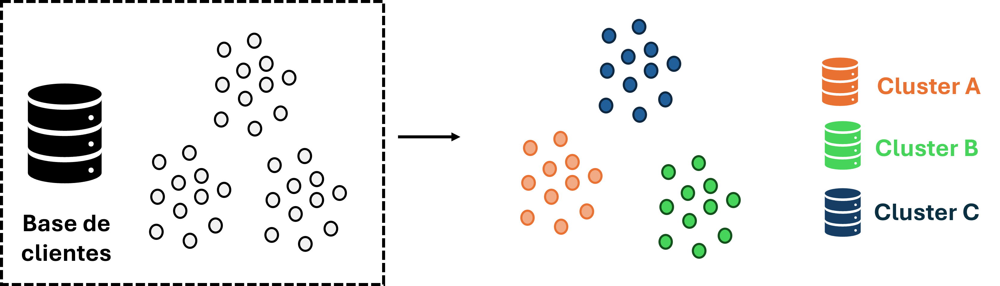
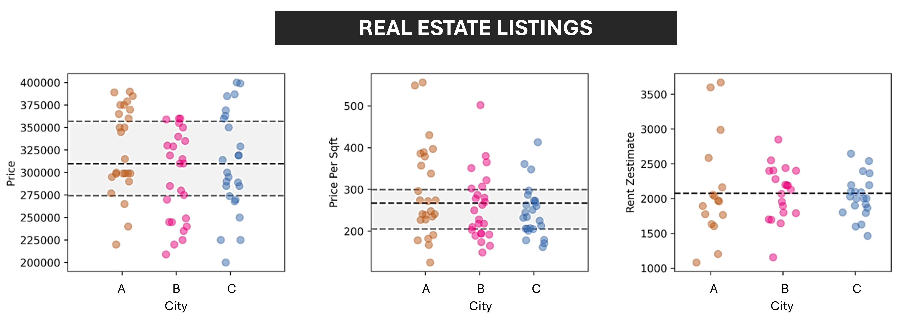

Bem-vindo ao meu portfolio de Análise de Dados. Nesta página, você encontrará os seguintes projetos:

## **Segmentação de clientes do setor com Machine Learning**

{width=90%}

## **Análise de churn**

{width=70%}

## **Buscando oportunidades com os dados da Zillow (EUA, setor imobiliário)**

{width=90%}

> Desenvolvido com Quarto markdown (mais detalhes em <https://quarto.org/docs/websites>).
